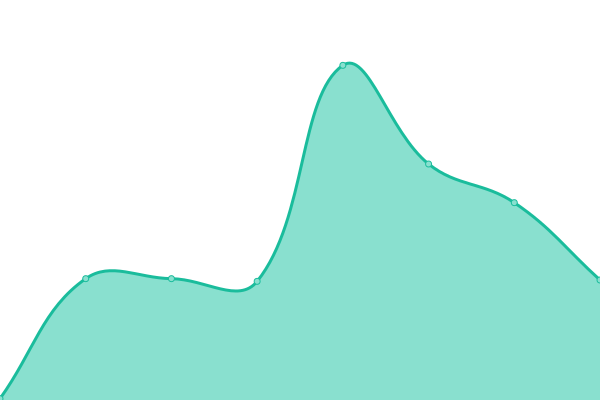

# [📈 Live Status](https://status.tvdn.me): <!--live status--> **🟧 Partial outage**

This repository contains the open-source uptime monitor and status page for [ThomasIAm](https://github.com/ThomasIAm), powered by [Upptime](https://github.com/upptime/upptime).

With [Upptime](https://upptime.js.org), you can get your own unlimited and free uptime monitor and status page, powered entirely by a GitHub repository. We use [Issues](https://github.com/upptime/upptime/issues) as incident reports, [Actions](https://github.com/ThomasIAm/upptime/actions) as uptime monitors, and [Pages](https://demo.upptime.js.org) for the status page.

<!--start: status pages-->
<!-- This summary is generated by Upptime (https://github.com/upptime/upptime) -->
<!-- Do not edit this manually, your changes will be overwritten -->
<!-- prettier-ignore -->
| URL | Status | History | Response Time | Uptime |
| --- | ------ | ------- | ------------- | ------ |
|  [tvdn.me](https://tvdn.me) | 🟩 Up | [tvdn-me.yml](https://github.com/ThomasIAm/upptime/commits/HEAD/history/tvdn-me.yml) | 

 235ms
     
 | 

<a href="https://status.tvdn.me/history/tvdn-me">100.00%</a>
    

|  [wiki.tvdn.me](https://wiki.tvdn.me) | 🟩 Up | [wiki-tvdn-me.yml](https://github.com/ThomasIAm/upptime/commits/HEAD/history/wiki-tvdn-me.yml) | 

 401ms
     
 | 

<a href="https://status.tvdn.me/history/wiki-tvdn-me">97.64%</a>
    

|  [ai.tvdn.me](https://ai.tvdn.me) | 🟩 Up | [ai-tvdn-me.yml](https://github.com/ThomasIAm/upptime/commits/HEAD/history/ai-tvdn-me.yml) | 

 124ms
     
 | 

<a href="https://status.tvdn.me/history/ai-tvdn-me">97.64%</a>
    

|  [old.tvdn.me](https://old.tvdn.me) | 🟩 Up | [old-tvdn-me.yml](https://github.com/ThomasIAm/upptime/commits/HEAD/history/old-tvdn-me.yml) | 

 250ms
     
 | 

<a href="https://status.tvdn.me/history/old-tvdn-me">97.64%</a>
    

|  [pp3.tvdn.me](https://pp3.tvdn.me) | 🟩 Up | [pp3-tvdn-me.yml](https://github.com/ThomasIAm/upptime/commits/HEAD/history/pp3-tvdn-me.yml) | 

 502ms
     
 | 

<a href="https://status.tvdn.me/history/pp3-tvdn-me">97.64%</a>
    

|  [vm2.tvdn.me](https://vm2.tvdn.me) | 🟥 Down | [vm2-tvdn-me.yml](https://github.com/ThomasIAm/upptime/commits/HEAD/history/vm2-tvdn-me.yml) | 

 5346ms
     
 | 

<a href="https://status.tvdn.me/history/vm2-tvdn-me">0.00%</a>
    

<!--end: status pages-->

[**Visit our status website →**](https://status.tvdn.me)

## 📄 License

- Code: [MIT](./LICENSE) © [Upptime](https://upptime.js.org)
- Data in the `./history` directory: [Open Database License](https://opendatacommons.org/licenses/odbl/1-0/)
